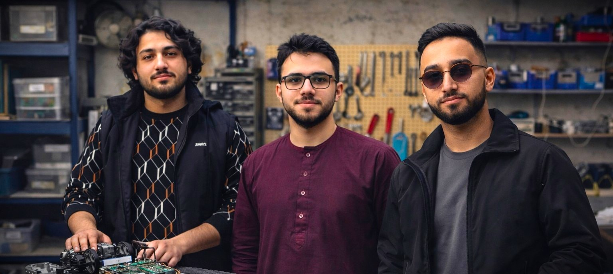

# KBL Rescue - TS-900 Tracked Rescue Robot (2026)


> Open-source, educational tracked rescue robot for disaster-response scenarios and student competitions.

## KBL Rescue Team

Left to right: Shabiruddin Omar, Ahmad Ferdows Ahmadi, Milad Akhtari, working on the TS-900 tracked rescue robot.
KBL Rescue is a small independent student robotics team led by Ahmad Ferdows Ahmadi (computer science student).
We build a tracked rescue robot based on the TS-900 chassis for rough terrain and collapsed-structure simulations.

## Competitions
- RoboCup Rescue Robot League 2026 (Incheon, South Korea)
- TEKNOFEST Turkey
- TAC Challenge Norway
- RoboNation

## Project Goals
- Rugged navigation on uneven terrain
- Victim detection (thermal + visual)
- Mapping and localization (SLAM)
- Modular payload bay for research sensors

## Hardware

### Base Chassis: TS-900 (Commercial)
Why we chose it:
- Shock-absorbing tracked suspension for rough terrain
- Metal frame for durability and payload capacity
- Compatible with Arduino/Raspberry Pi integration

Common variant specs:
- Dimensions: 550 x 280 x 110 mm (L x W x H)
- Weight: 3.6-5.15 lbs (1.6-2.3 kg), listing-dependent
- Load capacity: 5-15 kg
- Materials: metal frame (aluminum alloy/stainless steel), engineering plastic tracks
- Suspension: independent shock-absorbing suspension on each wheel
- Motors: 4 x 12V DC high-torque with encoders

Why great for KBL Rescue:
- Excellent for rough terrain
- Easy Arduino/Raspberry Pi integration
- High payload for sensors and batteries

Example product listings (non-official):
- AliExpress (selected chassis): https://www.aliexpress.com/item/1005008874710536.html?spm=a2g0n.detail.platformRecommendH5.14.4df1Yj0DYj0DCa&gps-id=platformRecommendH5&scm=1007.18499.315613.0&scm_id=1007.18499.315613.0&scm-url=1007.18499.315613.0&pvid=067ac331-ce4a-4e80-a66e-a2349d311c51&_t=gps-id:platformRecommendH5,scm-url:1007.18499.315613.0,pvid=067ac331-ce4a-4e80-a66e-a2349d311c51,tpp_buckets:668%232846%238116%232002&pdp_ext_f=%7B%22order%22%3A%22-1%22%2C%22eval%22%3A%221%22%2C%22sceneId%22%3A%228499%22%2C%22fromPage%22%3A%22recommend%22%7D&pdp_npi=6%40dis%21AFN%2129087.23%2120360.80%21%21%21445.32%21311.72%21%402141131717698038742837458e6b61%2112000047044687256%21rec%21AF%21%21ABX%211%210%21n_tag%3A-29910%3Bd%3A492b4b0d%3Bm03_new_user%3A-29895&utparam-url=scene%3AplatformRecommendH5
- Amazon (similar listing): https://us.amazon.com/SZDoit-Absorption-Suspension-Raspberry-Education/dp/B0BYR9LDPQ

### Chassis Photo

Our base platform: TS-900 tracked chassis with shock absorption.


### Planned Custom Mods (Our Future STEP/STL)
- Sensor mast and camera/LiDAR mounts
- Top plate with modular pattern (M3/M4)
- Electronics enclosure + battery bay
- Front bumper and tow point
- Quick-swap payload tray

### Reference Models and Similar Tracked Platforms
Use these for inspiration and mechanical concepts:
- HowToMechatronics (fully 3D printed tank): https://howtomechatronics.com/projects/fully-3d-printed-tank-tracked-robot-platform/
- Domechy DZ01 tracked robot project: https://domechy.com/projects/dz01-diy-3d-printed-tracked-mobile-robot/
- GrabCAD tank track model: https://grabcad.com/library/tank-track-2
- GrabCAD tracked tread assembly tutorial: https://grabcad.com/tutorials/robotic-tank-tread-assembly-fusion-360-tutorial-tracked-robot-part-2
- Sketchfab tracked robot example: https://sketchfab.com/3d-models/builder-tracked-robot-171a8ad07bc74f67af520ac8c67ae06f
- Printables.com RC Tracked Robot by Floppy Lab: https://www.printables.com/model/583146-rc-tracked-robot (includes STL/STEP/3MF files, Arduino code, and schematics for reference)

## Software Status
| Subsystem | Stack | Status |
| --- | --- | --- |
| Low-level motor control | Arduino/C++ | Planned |
| High-level autonomy | Python | Planned |
| Robotics middleware | ROS 2 | Planned |
| Perception | OpenCV + sensors | Planned |

## Repository Structure
```
hardware/
  ts900-reference.md
  bom.md
  wiring-diagram.txt
src/
  arduino/arduino-sketch.ino
  python/main.py
docs/
  team-overview.md
media/
  README.md
```

## Media
Team and chassis photos are embedded above.

## Setup

### Clone
```
git clone https://github.com/Ferdows-Ahmadi/kbl-rescue-robot-2026.git
cd kbl-rescue-robot-2026
```

### Python
```
python -m venv .venv
.venv\Scripts\activate
pip install -r requirements.txt
```

### Arduino

## Contributing
We welcome contributions from students, mentors, and the community.
See `CONTRIBUTING.md` for guidelines.

## Sponsors and Acknowledgments
This project is open-source and educational (non-commercial). We are open to hardware/electronics sponsorships and in-kind support.
Special thanks to GitHub Education for supporting student teams. We use Copilot Pro via the Student Developer Pack for code assistance.

## Seeking Support
- Hardware donations or discounts (sensors, motors, controllers)
- We feature your logo/credits in documentation, presentations, competition videos, and social media
- Contact: ahmadferdowsahmadi@gmail.com

## License
MIT License. See `LICENSE`.

