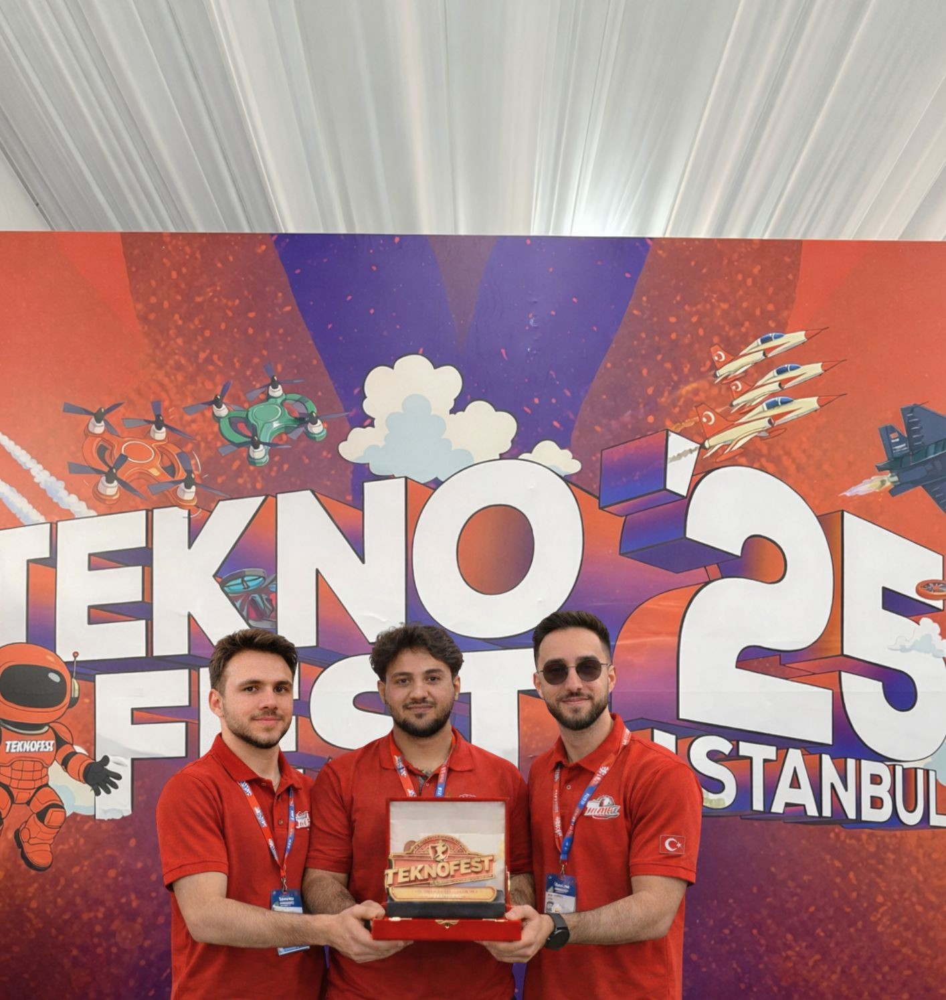
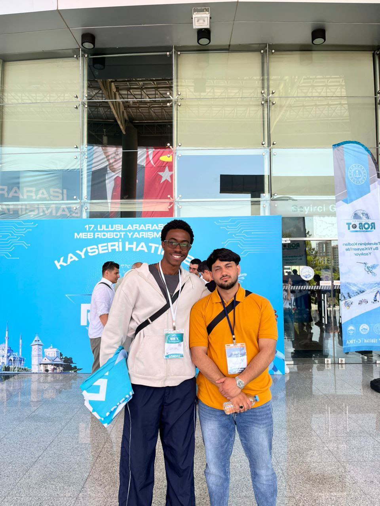
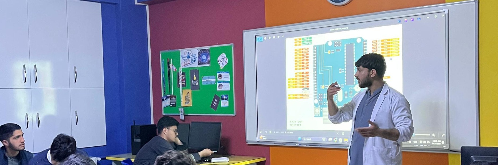
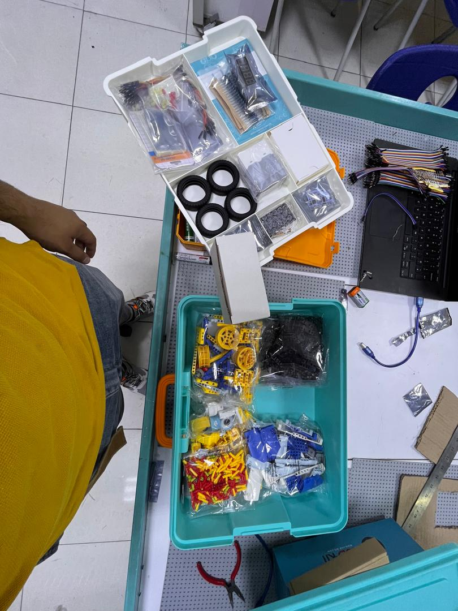

# Achievements / Proof

## Overview
The team prepared a **Technology for the Humanity** project document associated with TEKNOFEST 2025 (per the official PDF in this repo). This section summarizes the documented work and provides supporting evidence.

## Team and Official Identifiers (from PDF)
- Competition / Track: **Technology for the Humanity** (as titled in the PDF)
- Year: **2025** (from the document filename)
- Team name / ID: **Not stated in the provided PDF**

## What the Team Built (high-level)
Based on the official document, the team described a firefighting-assist robot concept that:
- Operates in hazardous fire environments where humans cannot enter
- Uses sensors and a camera module for environmental awareness
- Reports conditions to a web interface using an ESP32-based system

## Evidence
- Official document: [docs/proof/teknofest-2025-official-info.pdf](proof/teknofest-2025-official-info.pdf)

Photos:

## Videos
See: [media/teknofest-2025/videos/README.md](../media/teknofest-2025/videos/README.md)

## Connection to This Repository
This repository continues the student-led development of a tracked rescue robot platform, building on lessons from the Technology for the Humanity project documentation and focusing on robust field-ready implementation.

## Contact
Email: ahmadferdowsahmadi@gmail.com
